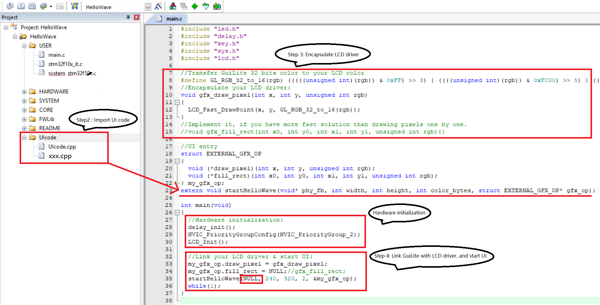

# How to build for Win MFC?
1. Open "HelloWave\BuildMFC\HelloWave.sln" by Visual studio 2017
2. Click `F5` to build/run `HelloWave`

# How to build for STM32F103 + ILI934x?
## Prerequisite:
- Install Keil uvsion 5.6 or above.
- Your hardware should be compatible with: Discovery kit/[正点原子开发板](https://item.taobao.com/item.htm?spm=a230r.1.14.20.17b441b9u49Ujg&id=582084489839&ns=1&abbucket=7#detail)/野火霸道开发板.

## Build
1. Open "HelloWave\BuildSTM32F103-Keil\USER\HelloWave.uvprojx" with Keil uvsion.
2. Choose your Device type(Default: STM32F103ZE) from option for target.
3. Build HelloWave.
4. Connect your hardware with your host PC, and flash/run HEX file on it.

# How to port on any type of MCU?
## Prerequisite:
- You have Keil/IAR project which can enable LCD
- Your project should implement function `void delay_ms(unsigned short nms)`, which would be used by core/src/adapter/api_none.cpp::thread_sleep

## Porting

1. Open your Keil/IAR project
2. Import all cpp files from `UIcode` in your project
3. Encapsulate draw piexel driver in `main.c`
4. Link your LCD driver with GuiLite, and call UI entry function(e.g, startHelloWave)
5. Build & Run

# How to build for Linux?
## Compile & Run locally:
1. Compile:
    - `cd HelloWave`
    - `cmake . && make`
    - `cd BuildLinux`
    - `chmod 777 *`
2. Run locally(e.g, Ubuntu):
    - Run with framebuffer: `sudo ./HelloWave /dev/fb0`&nbsp;&nbsp;&nbsp;&nbsp;/dev/fb0: The path of framebuffer device file.
    - Run inside X Window: `sudo ./xWindow 240 320 | ./HelloWave shared-fb`

## Cross compiler & Run on target:
1. install compiler:
    - For ARM32: `sudo apt-get install g++-arm-linux-gnueabi gcc-arm-linux-gnueabi`
    - For ARM64: `sudo apt-get install g++-aarch64-linux-gnu gcc-aarch64-linux-gnu`
2. Cross compile:
    - `cd HelloWave`
    - For ARM32: `cmake -D CMAKE_C_COMPILER="/usr/bin/arm-linux-gnueabi-gcc" -D CMAKE_CXX_COMPILER="/usr/bin/arm-linux-gnueabi-g++" . && make`
    - For ARM64: `cmake -D CMAKE_C_COMPILER="/usr/bin/aarch64-linux-gnu-gcc" -D CMAKE_CXX_COMPILER="/usr/bin/aarch64-linux-gnu-g++" . && make`
3. Run on target Linux device:
    - Copy BuildLinux/HelloWave to target Linux device
    - `chmod 777 HelloWave`
    - `sudo ./HelloWave /dev/fb0`&nbsp;&nbsp;&nbsp;&nbsp;/dev/fb0: The path of framebuffer
